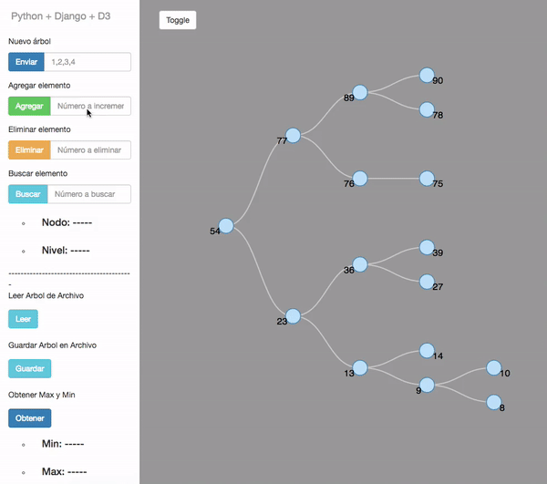

# Binary Tree Search + Django + D3.js
### Auto Balance Binary Tree Search or AVL tree  ( self-balancing binary search tree.) display with D3.js

### Demo


Clone this repository type in your terminal:
```sh
$ git clone https://github.com/GerardoLSJ/BTS-Django-D3.js.git

OR

Download as zip.
```


To run make sure you have ``` pip ``` installed. (Python Package Manager) and then install ``` Django``` (Python web Framework)
```sh
$ pip install django
```
Then change you directory to the main app:

```sh
$ cd BTS-Django-D3.js
$ cd django-d3
```


Your are now in our app directory. 
The first time you are here you have to run this command (Not neede for further executions):

```sh
$ python manage.py migrate
```

and then then to start the server: 
```sh
$ python manage.py runserver
```

Now just open your localhost at 8000 port.

```sh
    http://localhost:8000/
```

### Play with it!


The main functionality is at:
```
/static/main.js  at the first directory
```
### and at:
```
django-d3/views.py
```
